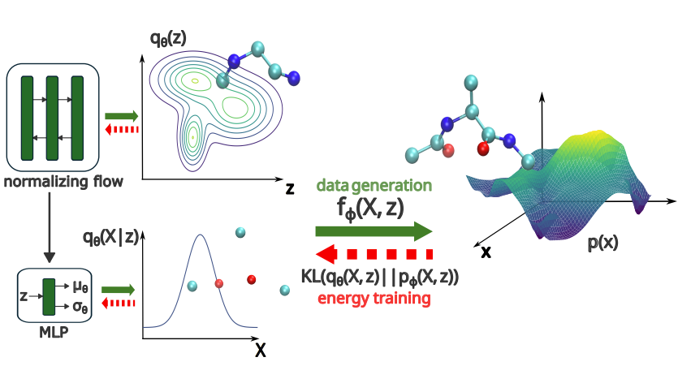

# Energy-Based Coarse-Graining in Molecular Dynamics: A Flow-Based Framework without Data

[**Getting Started**](#getting-started) | [**Data sets**](#data-sets) | [**Installation**](#installation) |  [**Requirements**](#requirements) |  [**Citation**](#citation)

Implementation of the Energy-based Coarse-graining method with flows in the paper [Energy-Based Coarse-Graining in Molecular Dynamics: A Flow-Based Framework without Data](https://doi.org/10.1021/acs.jctc.5c01504).

<p align="center">
  <figure>
    
    <figcaption><em>Overview of the generative framework.</em></figcaption>
  </figure>
</p>

## Getting started
This repository provides the code to train a coarse-graining framework on the energy function of the Boltzmann distribution. The model defines slow and fast variables and learns a bijective map and normalizing flow to map them back to the atomistic coordiantes. The framework is illustrated on three different systems: a double-well (DW) potential, a Gaussian Mixture Model (GMM), and coarse-grained alanine dipeptide (ALDP). 

The training examples can be found in:

- [example_dw.py](examples/example_dw.py)
- [example_gmm.py](examples/example_gmm.py)
- [example_aldp.py](examples/example_aldp.py)

Training the flow with for the DW and GMM example takes a few minutes, while the alanine dipeptide example takes around a day. Trained models will be provided in [pretrained_ecg_aldp_model.eqx](pretrained_models/ecg_aldp) (coming soon).

## Data sets
The data sets for the double-well and alanine dipeptide can be downloaded from the following Google Drive link:</br>[https://drive.google.com/drive/folders/1cZBMiqBnL34uWclKzz-2l2SuXK_L3enW?usp=sharing](https://drive.google.com/drive/folders/1cZBMiqBnL34uWclKzz-2l2SuXK_L3enW?usp=sharing).</br> After downloading, the reference files should be moved into the corresponding datasets folder for [double-well](datasets/dw) and
[alanine dipeptide](datasets/aldp).

## Installation
All dependencies can be installed locally with pip:
```
pip install -e .[all]
```

However, this only installs a CPU version of [Jax](https://github.com/jax-ml/jax?tab=readme-ov-file#installation). If you want to enable GPU 
support, please overwrite jaxlib.

## Requirements
The repository uses with the following packages:
```
    'jax<=0.6.2',
    'flowjax>=17.2.0',
    'chemtrain>=0.2.1',
    'matplotlib',
    'seaborn',
```
The code was run with Python >= 3.10. The packages used in the paper are listed in [pyproject.toml](pyproject.toml).

## Citation
Please cite our paper if you use this code in your own work:
```
@article{stupp_ecg_2025,
  title = {Energy-Based Coarse-Graining in Molecular Dynamics: A Flow-Based Framework without Data},
  author = {Stupp, Maximilian and Koutsourelakis, P. S.},
  journal={Journal of Chemical Theory and Computation},
  volume = {0},
  number = {0},
  pages = {null},
  year = {2025},
  doi = {10.1021/acs.jctc.5c01504}
}
```
